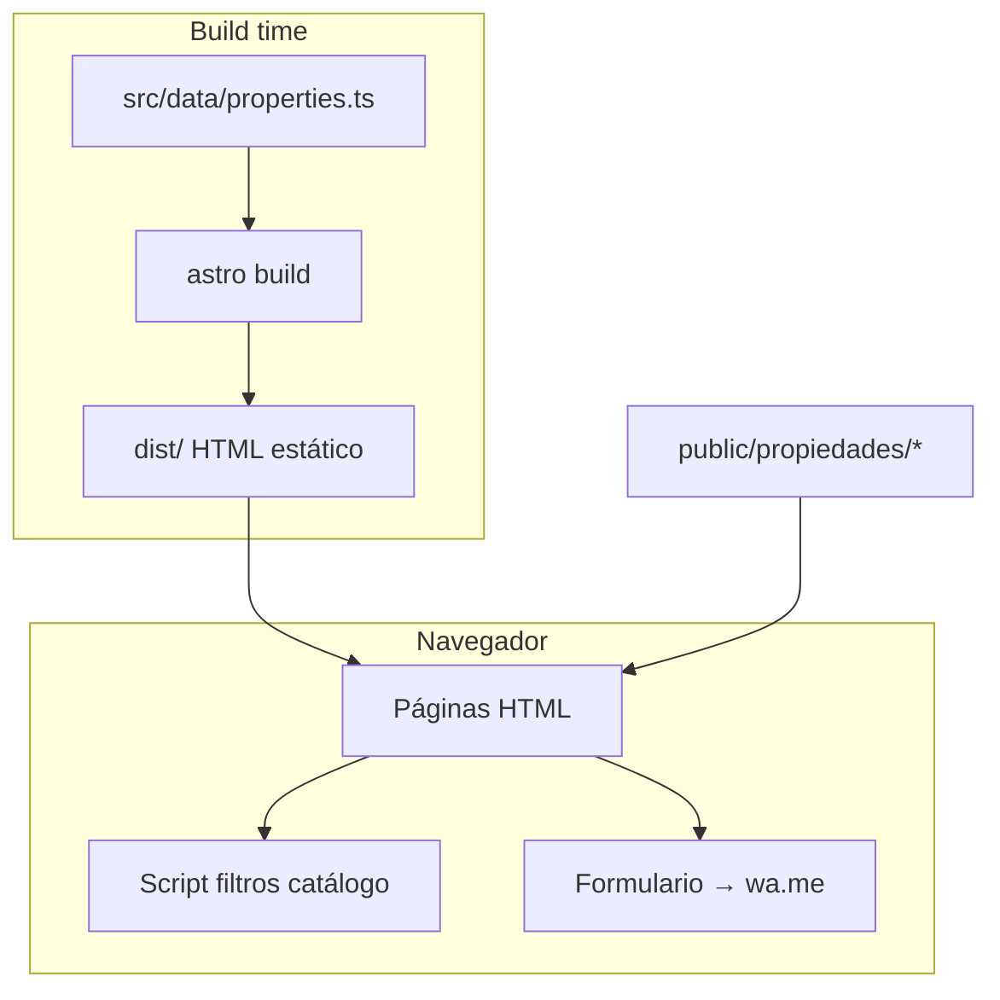
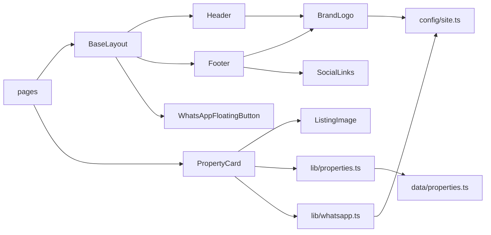

# LM negocios inmobiliarios — Documentación del proyecto

Sitio web estático para **LM · negocios inmobiliarios** (Paraná, Entre Ríos). Reemplaza la presencia en Tokko Broker con un catálogo propio, imágenes alojadas localmente y contacto directo por WhatsApp.

- **Dominio previsto:** [lmneginmobiliarios.com.ar](https://lmneginmobiliarios.com.ar)
- **Origen de datos:** migración desde Tokko (51 propiedades, ~812 fotos)
- **Deploy recomendado:** Cloudflare Pages (`npm run build` → carpeta `dist/`)

---

## Stack tecnológico

| Tecnología | Versión / uso |
|------------|----------------|
| [Astro](https://astro.build) | 6.x — SSG (sitio 100 % estático) |
| TypeScript | Tipado estricto en datos y utilidades |
| Tailwind CSS | 4.x vía `@tailwindcss/vite` |
| Fontsource | DM Sans (cuerpo) + Playfair Display (títulos), sin Google Fonts CDN |
| `@astrojs/sitemap` | Sitemap automático en build |
| Node.js | `>= 22.12.0` |

No hay base de datos ni API en runtime: el catálogo vive en `src/data/properties.ts` y las imágenes en `public/`.

---

## Arquitectura general



**Principios de diseño:**

1. **Independencia de Tokko en producción** — ninguna URL remota de imágenes; `remotePatterns: []` en Astro.
2. **Contacto honesto** — el formulario no simula un backend: abre WhatsApp con el mensaje armado.
3. **Componentes reutilizables** — tarjetas, imágenes y marca centralizados.
4. **Filtros en cliente** — en `/propiedades` se ocultan/muestran tarjetas y se sincroniza la URL (`?operation=venta&...`).

---

## Estructura de carpetas

```
astro-lmneg-inmobiliarios/
├── astro.config.mjs          # site URL, sitemap, Tailwind, sin imágenes remotas
├── package.json
├── tsconfig.json
├── public/                     # Archivos servidos tal cual
│   ├── favicon.svg
│   ├── og-default.svg
│   ├── logo-lm.jpg
│   ├── assets/
│   │   ├── hero-home.jpg
│   │   └── property-placeholder.png
│   └── propiedades/            # 51 carpetas × fotos JPG (~113 MB)
│       └── {tokkoId}/01.jpg …
├── scripts/
│   └── publish-images-to-public.mjs   # Único script activo de mantenimiento
├── papelera/                   # Scrapers históricos (no usados en build)
├── src/
│   ├── config/site.ts          # Datos globales de la inmobiliaria
│   ├── data/properties.ts      # Catálogo completo (51 ítems)
│   ├── lib/
│   │   ├── properties.ts       # Helpers de catálogo
│   │   └── whatsapp.ts         # URLs wa.me
│   ├── styles/global.css       # Tailwind + tokens de marca
│   ├── layouts/BaseLayout.astro
│   ├── components/             # UI reutilizable
│   └── pages/                  # Rutas del sitio
└── dist/                       # Salida de `npm run build` (gitignored)
```

---

## Configuración global — `src/config/site.ts`

Objeto `SITE` con toda la información institucional y de contacto:

| Campo | Descripción |
|-------|-------------|
| `name`, `subtitle` | Marca corta: **LM** + *negocios inmobiliarios* |
| `brandFull` (export) | `"LM · negocios inmobiliarios"` para títulos y WhatsApp |
| `tagline`, `description` | SEO y pies de página |
| `city`, `province`, `country` | Paraná, Entre Ríos, Argentina |
| `addressLine`, `address` | Victoria 386 - Oficina 5 |
| `phone`, `phoneDisplay` | 3434647737 |
| `whatsappNumber` | `PUBLIC_WHATSAPP_NUMBER` o fallback `5493434647737` |
| `email` | contacto@lmneginmobiliarios.com.ar |
| `logoSrc` | `/logo-lm.jpg` |
| `instagramUrl`, `facebookUrl` | Redes sociales |
| `mission`, `vision`, `values` | Textos de Nosotros |
| `legalDisclaimer` | Aviso legal en footer |

**Variable de entorno opcional:**

```env
PUBLIC_WHATSAPP_NUMBER=5493434647737
```

---

## Datos del catálogo — `src/data/properties.ts`

### Tipos

```ts
Operation = 'venta' | 'alquiler'
PropertyType = 'departamento' | 'casa' | 'ph' | 'duplex' | 'cochera' | 'terreno' | 'local'
PropertyStatus = 'disponible' | 'reservada' | 'alquilada' | 'vendida'
Currency = 'USD' | 'ARS'
```

### Interfaz `Property`

| Campo | Uso |
|-------|-----|
| `id` | `prop-{tokkoId}` |
| `slug` | URL: `/propiedades/{slug}/` |
| `title` | Título visible |
| `operation`, `type`, `status` | Filtros y badges |
| `price`, `currency` | Precio formateado |
| `neighborhood`, `city` | Ubicación |
| `coveredM2`, `semiCoveredM2` | Superficies |
| `rooms`, `bathrooms` | Métricas (condicionales en ficha) |
| `description` | Párrafo SEO / ficha |
| `features` | Lista en ficha |
| `heroImage` | Imagen principal (`/propiedades/...`) |
| `galleryImages` | Array de rutas locales |
| `refCode` | Referencia Tokko (ej. LHO8046943) |
| `tokkoId` | ID numérico Tokko (carpeta de fotos) |

### Constantes

- `DEFAULT_PROPERTY_IMAGE` → `/assets/property-placeholder.png`
- `properties` → array de 51 propiedades (hoy todas `operation: "venta"`)
- `featuredPropertyIds` → 6 IDs mostrados en la home

### Rutas de imágenes

Convención: `/propiedades/{tokkoId}/01.jpg`, `02.jpg`, … copiadas desde `downloads/tokko-images/` con el script `publish-images`.

---

## Utilidades — `src/lib/`

### `properties.ts`

| Función | Descripción |
|---------|-------------|
| `formatPrice(price, currency)` | `Intl.NumberFormat` es-AR (USD/ARS, sin decimales) |
| `getPropertyBySlug(slug)` | Busca por slug en el catálogo |
| `getFeaturedProperties()` | Filtra por `featuredPropertyIds` |
| `getPropertyGalleryImages(property)` | Galería o fallback a hero/placeholder |
| `operationLabel(operation)` | "Venta" / "Alquiler" |
| `typeLabel(type)` | Etiqueta legible del tipo |
| `catalogHasOperation(operation)` | Si existe al menos una propiedad con esa operación (oculta filtro alquiler si no hay) |
| `showsRoomMetrics(type)` | `false` para terreno, cochera y local |
| `formatPropertyMeta(property)` | Línea "Barrio, ciudad · N amb · N m²" para tarjetas |

### `whatsapp.ts`

| Función | Descripción |
|---------|-------------|
| `buildWhatsAppLink(message)` | `https://wa.me/{número}?text=...` |
| `buildPropertyWhatsAppLink(title, operation, refCode?)` | Mensaje prearmado para una propiedad |

---

## Layout — `src/layouts/BaseLayout.astro`

Plantilla HTML de todas las páginas.

**Props:**

| Prop | Default | Uso |
|------|---------|-----|
| `title` | (requerido) | `<title>` y `og:title` |
| `description` | `SITE.description` | meta description / OG |
| `ogImage` | `/og-default.svg` | Open Graph (fichas usan `heroImage`) |

**Incluye:**

- `Header`, `Footer`, `WhatsAppFloatingButton`
- Skip link de accesibilidad (`#main-content`)
- Meta canonical, Open Graph, Twitter card
- Estilos globales para `.font-display` (Playfair)

---

## Componentes — referencia detallada

### `BrandLogo.astro`

Logo + texto de marca enlazado a `/`.

| Prop | Tipo | Default | Descripción |
|------|------|---------|-------------|
| `size` | `'sm' \| 'md'` | `'sm'` | Altura imagen: 44px / 64px |
| `showText` | `boolean` | `true` | Muestra "LM" y subtítulo |

- Imagen: `SITE.logoSrc`, `alt={brandFull}`
- Usado en **Header** (sm) y **Footer** (md, solo logo visual con texto)

---

### `Header.astro`

Barra superior en dos franjas:

1. **Barra info** — ciudad, dirección y teléfono (solo desktop en línea 2).
2. **Header sticky** — `BrandLogo` + navegación: Inicio, Propiedades, Nosotros, FAQ, Contacto.

No recibe props; enlaces definidos en `navLinks` interno.

---

### `Footer.astro`

Grid de 3 columnas (responsive):

1. Marca + tagline (`BrandLogo`, `SITE.tagline`)
2. Enlaces rápidos
3. Dirección, teléfono, enlace WhatsApp, `SocialLinks`

Pie con copyright dinámico y `SITE.legalDisclaimer`.

---

### `SocialLinks.astro`

Enlaces a Instagram y Facebook desde `SITE`.

| Prop | Descripción |
|------|-------------|
| `class` | Clases extra en el contenedor flex |

---

### `PropertyCard.astro`

Tarjeta de listado (home, catálogo, filtros).

| Prop | Tipo | Descripción |
|------|------|-------------|
| `property` | `Property` | Datos completos |
| `filterIndex` | `number?` | Índice original para orden "relevancia" (`data-index`) |

**Estructura:**

- `<article class="property-card">` con atributos `data-*` para filtros JS:
  - `data-operation`, `data-type`, `data-neighborhood`, `data-currency`, `data-price`, `data-rooms`, `data-index`
- Imagen con `ListingImage` (enlace al detalle)
- Badges operación + tipo
- Título, `formatPropertyMeta`, `formatPrice`
- Botones: **Ver detalle** → `/propiedades/{slug}` · **Consultar** → WhatsApp (`buildPropertyWhatsAppLink`)

---

### `ListingImage.astro`

Wrapper de `` para listados (sin optimización Astro Image, rutas locales directas).

| Prop | Default | Descripción |
|------|---------|-------------|
| `src`, `alt` | — | Obligatorios |
| `width`, `height` | 900×600 | Atributos HTML |
| `class` | `''` | Clases Tailwind |
| `loading` | `'lazy'` | `'eager'` en hero de ficha |

---

### `WhatsAppFloatingButton.astro`

Botón fijo inferior derecho en **todas** las páginas (vía layout). Icono SVG + texto "WhatsApp". Mensaje genérico de consulta.

---

### `ui/ButtonLink.astro`

CTA reutilizable (enlaces internos).

| Prop | Valores | Descripción |
|------|---------|-------------|
| `href` | string | Destino |
| `label` | string | Texto |
| `variant` | `primary` \| `secondary` | Amarillo marca vs borde blanco/gris |

Usado en **home** y **nosotros**.

---

## Páginas — `src/pages/`

| Ruta | Archivo | Descripción |
|------|---------|-------------|
| `/` | `index.astro` | Hero con foto, highlights, 6 destacadas (`PropertyCard`), CTA vender/alquilar |
| `/propiedades` | `propiedades/index.astro` | Catálogo con filtros client-side + grid de `PropertyCard` |
| `/propiedades/{slug}` | `propiedades/[slug].astro` | Ficha estática (`getStaticPaths` × 51) |
| `/nosotros` | `nosotros.astro` | Misión, visión, valores, oficina |
| `/faq` | `faq.astro` | Acordeones `<details>` con 5 preguntas |
| `/contacto` | `contacto.astro` | WhatsApp, formulario → wa.me, redes |

### Ficha de propiedad (`[slug].astro`)

- Breadcrumb, hero, badges, precio, descripción
- Cuadrícula de métricas **condicional** (`showsRoomMetrics`, m² > 0)
- Galería resto de fotos si hay más de una
- Lista `features`
- CTAs: WhatsApp + enlace a contacto con query `?property=&title=`

### Catálogo — script de filtros

Comportamiento en el cliente (`<script>` en `propiedades/index.astro`):

1. Lee formulario `#filters-form`
2. Sincroniza criterios con `history.replaceState` (query string)
3. Al cargar, restaura filtros desde URL
4. Oculta tarjetas que no cumplen criterios
5. Reordena DOM según sort: relevancia / precio asc / desc
6. Muestra contador y estado vacío `#empty-state`

Filtros: operación, tipo, barrio, moneda, precio min/max, ambientes mínimos, orden.

### Contacto — formulario

- Campo honeypot `website` (anti-bots básico)
- Query `?property=slug&title=...` prellena mensaje y slug oculto
- Submit: validación → `window.open` a WhatsApp con cuerpo estructurado
- No persiste en `localStorage` ni envía email por sí solo

---

## Estilos — `src/styles/global.css`

**Tokens `@theme` (Tailwind 4):**

| Token | Color | Uso |
|-------|-------|-----|
| `brand-yellow` | #f5c518 | CTAs, acentos |
| `brand-yellow-dark` | #d4a80f | Hover |
| `brand-yellow-soft` | #fff9e6 | Fondos suaves |
| `brand-gray-*` | Escala gris | Texto, bordes, fondos |

**Tipografía:**

- Cuerpo: DM Sans Variable
- Títulos: Playfair Display 600/700 (clase `.font-display`)

---

## Scripts npm

| Comando | Acción |
|---------|--------|
| `npm run dev` | Servidor desarrollo Astro |
| `npm run build` | Genera `dist/` (56 páginas) |
| `npm run preview` | Sirve el build local |
| `npm run publish-images` | Copia `downloads/tokko-images/{id}/*` → `public/propiedades/{id}/` y actualiza rutas en `properties.ts` |

### `publish-images-to-public.mjs`

Flujo para **nuevas fotos** tras descargar manualmente a `downloads/`:

1. Lista JPG/PNG/WebP por carpeta `tokkoId`
2. Copia a `public/propiedades/{tokkoId}/`
3. Reescribe `heroImage` y `galleryImages` en el bloque `prop-{tokkoId}` de `properties.ts`
4. Soporta `--dry-run`

---

## Assets en `public/`

| Ruta | Contenido |
|------|-----------|
| `/logo-lm.jpg` | Logo oficial |
| `/assets/hero-home.jpg` | Fondo hero home (opacity 25 %) |
| `/assets/property-placeholder.png` | Fallback sin imagen |
| `/propiedades/{tokkoId}/NN.jpg` | Galerías (~818 archivos, 51 carpetas) |
| `/favicon.svg`, `/og-default.svg` | Icono y OG por defecto |

`downloads/` está en `.gitignore`; `public/propiedades/` **sí** se versiona (peso elevado del repo).

---

## Papelera (`papelera/`)

Scripts y fixtures del **scrape inicial** desde Tokko. No participan del build. Ver `papelera/README.md` si necesitás reimportar o regenerar datos.

---

## Despliegue (Cloudflare Pages)

1. Conectar repositorio
2. **Build command:** `npm run build`
3. **Output directory:** `dist`
4. **Node version:** 22+
5. Variable opcional: `PUBLIC_WHATSAPP_NUMBER`

El sitemap se genera en `dist/sitemap-index.xml` gracias a `@astrojs/sitemap` y `site` en `astro.config.mjs`.

---

## Cómo agregar o actualizar una propiedad

1. Añadir o editar el objeto en `src/data/properties.ts` (respetar tipos y `slug` único).
2. Colocar fotos en `downloads/tokko-images/{tokkoId}/` o directamente en `public/propiedades/{tokkoId}/`.
3. Ejecutar `npm run publish-images` si usás la carpeta `downloads/`.
4. Opcional: incluir `id` en `featuredPropertyIds` para la home.
5. `npm run build` y verificar la ruta `/propiedades/{slug}/`.

---

## Mapa de dependencias entre módulos



---

## Auditoría y mejoras futuras (referencia)

Temas documentados en `docs/AUDITORIA-TECNICA.md` (si existe en el repo):

- Optimizar peso de JPG en `public/propiedades/`
- Favicon desde logo real
- Redirects 301 desde URLs antiguas de Tokko
- Backend de formulario (Formspree, Worker) si se requiere email sin WhatsApp
- Ampliar catálogo con propiedades en alquiler cuando existan datos

---

## Licencia y créditos

Proyecto privado para LM negocios inmobiliarios. Catálogo e imágenes originados en migración desde Tokko Broker; uso exclusivo de la inmobiliaria.
